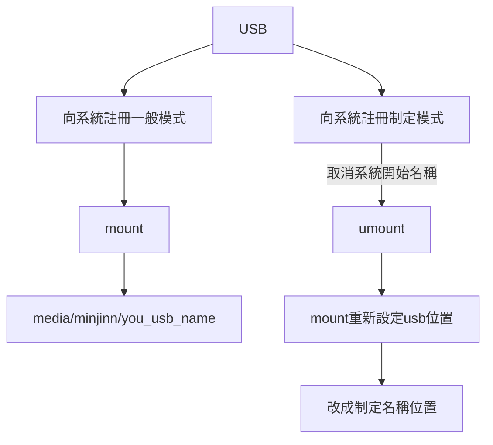

# 第一堂課 Linux

> [time=Wed, Mar 6, 2024 10:15 PM]


## 雲端

https://ntubedutw-my.sharepoint.com/:f:/g/personal/1053c031_ntub_edu_tw/Ej_vy9fCJY5NhcgAi7Lj_lQBhoSAWQbT9z3Pg2XE0L_Sqw

------

## 下載檔案

- [ ] VMware-player-16.1.1-17801498.exe
- [ ] ubuntu16-ssh.zip

---

## 設定

1. 開啟目錄


2. 選老師的


3. 按下 play

4. 選老師帳號 密碼 123456


5. open **VMware Workstation 16 Player  -> terminal**


### ==補充==
*  Terminal 放大 : ==Ctrl + Shift + (+)==
*  Terminal 縮小 : ==Ctrl + (-)==
 


---


## linux 指令 


### 一般查詢與移動指令

| 程式 | 說明 | 
| :--: | :--: |
| pwd  | 目前現在路徑位置 | 
| ls  | 底下有哪些物件 | 
| cd  | 前往資料位置 | 
| cd ..  | 返回相對路徑上一頁面 | 
| cd /00000/0000  | 這是絕對路徑 | 
| cd ./00000  | 這是相對路徑 | 
| ctrl + l   | 清除 | 


-----


### 帳號替換指令

| 程式 | 說明 | 
| :--: | :--: |
| su -  | 換當下使用者帳號 | 
| su - root  | 換超級帳號 (root 超級管理員) ，這時開頭會變成`＃` 字號| 
| sudo | 暫時提升管理權限| 
| passwd | 改密碼| 
| sudo passwd | 管理權限改密碼| 

### ==補充==
* root 權限時候開頭會是`＃`字號
* User 一般時候開頭會是`$`字號

----

> [name=RueianSu]
> 
> [time=Thu, Mar 7, 2024 4:17 PM]

# 第二堂課 Linux

echo 指令 = print 印出來

echo 的變數如果要顯示要加 $ 符號，例如：
```linux
x=0
echo $x
```


----

## linux 指令 

### $PATH 尋找環境變數
```linux
echo $PATH
```


----

### set  全部變數
```linux
set
```


----


### export 

1. 列出可用變數，每個人都會不同，因為權限不同

```linux
export
```


### 保留字 export vs set 區別

    

| 指令1 | 指令2 | 
| -------- | -------- | 
| export     | set     | 
|這是現在User有權限的才顯示給你看，如果沒有權限直接隱藏| 這是顯示全部，不管有沒有權限都顯示，這是保留字|

----


### export var 開放使用變數

設定方式如下:

```linux
//設定 name=value
export name=value
```

這是一個範例，命名一個叫做 name 變數，並且是value，之後就會在 export 指令看到，如下圖:

```linux
export
```


----

## linux 環境指令

| 指令  | 說明 | 
| -------- | -------- | 
| ps     | 目前環境     | 
| bash     | 開啟新環境     |
| exit     | 退出環境    |
| ls -l     |  查看詳細資料    |
| **ls -l ....位置**  |   可以看檔案詳細資料    |
| ls -li |    代表 全部 + 資訊   |
| ls -a  |    查看全部檔案 |


## linux 設定時間 


## linux 練習題目
### 練習題目


1. 輸入
```linux  
cd /sbin;ls -li e2fsck fsck.ext2
```


###  答案

1. 前往   `cd /sbin`
2. `;`代表 enter
3. 執行 `ls -li` 找到 `e2fsck` 與 `sck.ext2` 檔案


-> 代表捷徑


-------
## linux find介紹

### linux find使用方式

1. `find` 代表尋找，如果沒給他會狂跑，需要用ctrl + c來停止

2. `find --hellp` 尋找要得指令

3. `find -name e2fsck `這是  `-name` 指令代表 要查是名稱指令 `；` `e2fsck`是名稱


4. 尋找到` e2fsck` 檔案並且列出 `ls -li`

5. `sudo find / -name e2fsck -exec ls -li {} \;`


### 尋找指定名稱，包含 fsck

```linux
sudo find / -name *fsck*
```

### 尋找指定副檔名，包含 *.c

```linux
sudo find / -name *.c
```


----

## 查詢使用者資料名稱位置

以下是使用者資料名稱位置
```linux
/etc/passwd 
```


### `cat` 正向排序-查詢

```linux    
cat /etc/passwd 
```

### `tac` 逆向排序-查詢

```linux    
tac /etc/passwd 
```

### `head `指定區域正查詢

```linux  
head -n 5 /etc/passwd
```

### `tail` 指定區域逆查詢

```linux  
tail -n 5 /etc/passwd
```

### 使用 `pipe |` ，直接一次輸入


## 使用語法


| var | info | 例句 |
| -------- | -------- | -------- |
| tr  |    tr 轉換文字中符號    |  |
| cut |    cut 我要剪哪個段落，特別注意，要寫檢段落在哪裡，後面要有數字   ||
|  wc  | 計算數目，例如:字數 |
| $(....) | 是執行括弧中內容|
| fmt | 重新排列 |
| fmt -w  |如果是 -w 分割超過字會跳下一行 |


### 轉換 a-z 換大寫 A-Z
```linux
cat /etc/passwd | tr a-z A-Z
```
### 轉換透過-S 將空格變一個
```linux
cat /etc/passwd | tr -s " "
```

### 取得欄位 5和9的欄位
```linux    
ls -l |tr -s " " | cut -d " " -f5,9
```
### 替換成,分隔
```linux 
ls -l |tr -s " " ,| cut -d "," -f5,9
```

-----

## cut 

考試一
```linux
cut -d: -f1 /etc/passwd | fmt -w 20| head -1
```

考試二
```linux
cd / ; file $(ls | head -10)
```
----


## 加入 檔案
```linux
touch 
```
### 寫入檔案資料
```linux
touch infoData >  you user text name .txt 
```

### 新增資料夾 
```linux    
mkdir
```
### 新增多個資料夾
```linux
mkdir -q 
```


### 使用 nano 編輯文字
```linux
nano user.txt 
```


 

### nano vs nano -c 區別


| 指令 1 | 指令 2 | 
| -------- | -------- | 
| nano     | nano -c  | 
|沒行位置|有目前行位置|


**輸入**


**nano**


**nano -c**


----


# 第三堂課 Linux

> [name=RueianSu]
> [time=Fri, Mar 8, 2024 9:46 PM]

## 檔案指令
### 檔案複製
```linux
cp 3.txt 2.txt
```


---

### 資料夾複製 

```linux
cp -r dir2 dir3
```


---


### 移除檔案
```linux
rm 
```


---

### 移除資料夾
```linux
rm -r
```


---

### `mv` 移動檔案與資料夾
```linux
sudo mv x.txt /
```


---

### 練習

#### 程式 一
複製目錄 /etc/skel 到 現在位置

```linux
cp -r /etc/skel .
```


#### 程式 二
```linux
cp -rfv /etc/skel .
```


#### 程式 三

```linux
cp -rfvp /etc/skel .
```


#### `-rfv`個別代表


| var | 說明 | 
| -------- | -------- | 
| r     | 資料夾 |
| f | 不管有沒有強制做一次(強制取代功能) |
| v | 顯示紀錄log |
| p | 原有的時間不做更改 |


---

### 萬用符號


| var | 說名 | 示範 | 
| -------- | -------- | -------- | 
| *     | 所有檔案     | |
| ?     | 一個字的所有檔案     | |
| ??     |  兩個字的所有檔案    | |
| [a-z]     | 符合a~z的一個字的所有檔案      | |
| [0-9]     | 符合0~9的一個字的所有檔案      | |
| [!a-z]     | 不符合a~z的一個字的所有檔案      | |
| {}    | 包含單字     |  |

`*` 代表萬用字 `*.txt` 任何 `.txt` 檔案
```linux
 ls *.txt
``` 
 
 


`?` 代表字是一個的
```linux
 ls ?.txt
```


```linux
 ls ??.txt
```


---

## `[a-z] `語法

`[a-z].txt `代表1個字 a-z
`[a-z][a-z].txt` 代表2個字 a-z


`{}` 代表有包含這個單字，例如:`{aa,bb,cc}` 這代表找出 aa或bb或cc字


---

### 練習使用以下

*.{html,html}
*.[Tt][Xx][Tt]
*.???


---


| var | 說明 | 
| -------- | -------- | 
| find     | 找檔案     | 
| grep     | 找資料裡面內容    | 


```linux
cat /etc/passwd grep root
```
----

### `>` 的使用方式

這代表 判斷是否找到`1.txt`與`2.txt` 如果找到 寫入` ooo.txt` 如果沒有 寫入`xxx.txt`

```linux
 ls 1.txt 2.txt 1> ooo.txt 2> xxx.txt
```
----

### `2>&1`
如果兩個要到相同地方的話，要加入 2>&1 如下方

```linux
  ls 1.txt 2.txt >ooo.txt 2>&1
```


-----

### `>>`使用方式

`>>` 代表持續的寫入相同程式

```linux
ls 1.txt 2.txt >>ooo.txt 2>&1
```


### `<` 使用

< 代表寫入程式

### 練習

這會出現什麼? 解釋運作原理

```linux
$cp /etc/skel . 2> info.txt
```


答案:

 `$cp -r /etc/skel .`  代表複製 skel
 
` 2> info.txt `代表錯誤寫入`info.txt `


正確 cp 方式

```linux
$cp -r /etc/skel . 2> info.txt
```


----

### 指令結合


```linux
cat /etc/passwd |grep minjinn | cut -d: -f1,6
```


-----

## ps 查詢尋狀態

man ps 完整說明目錄

ps aux 有含編號(aux代表有編號的，但沒有執行順序)

(1) xeyes 開啟眼

(2) ps aux 狀態

---
## top 介紹

top 現在執行狀態


---

### pstree 樹狀顯示結果

```linux
pstree 
```


```linux
pstree | grep xeyes
```

用樹狀並篩選


---

## 尋找指定執行程序

透過 ps aux 找到全部後，在使用 grep 過濾保留 xeyes


```linux
ps aux | grep xeyes 
```

---


## 關閉執行程序

| 檔案 | 程序 | 說明 |
| -------- | -------- | -------- | 
| tiuch 、 nano     | xeyes     | 執行方式 | 
| rm   | kill     | 刪除 |


---

### kill

#### 指令
`kill` 是關閉檔案指令，後面是檔案編號，例如:

```linux
kill -15 64804
```

##### `15` 關閉檔案，但有可能結束不了
 
```
kill -15 64804
```


---

##### `2`號是馬上結束，但有可能結束不了

```linux
kill -2 64804
```

##### `9`號是一定會結束

```
kill -9 64804
```


##### `kill -19` 暫停程式

```linux
kill -19 程式編號
```

##### 總結


| 指令 | 說明 | 
| -------- | -------- | 
| kill -15     | 關閉檔案，但有可能結束不了     |
| kill -2    | 馬上結束，但有可能結束不了     |
| kill -9     | 一定會結束     |
| kill -19    | 暫停程式     |

---

### jobs 查看後台工作的程式

這是用於查看後台工作程式有哪些，例如:

```linux
jobs -l
```
就會顯示


---


### `fg` 前景執行

這是改為情景執行，例如:


---

### 背景執行 

在執行中最後面加入 `&`  就會被背景執行

```linux
xeyes &
```


---

## 查看執行排成

```linux
ps -el | head -1
```


-----


## nice與renice差別


nice vs renice 

| nice  | renice       |
| ------------ | ------------ |
| 啟動新的程式 | 修改現有程式 |

---

### 啟動執行排成

`nice 你要的目標 &` 範例如下：

```linux
nice xeyes &
```
---

### 啟動執行排成

開啟一個新的`eyes`跟改執行續變到`5`
```linux
nice -n 5 xeyes &
```


---

### 改執行排成 


renice 權限大小 權限編號


```linux
renice 5 2809
```

---

### 查看權限

使用 `ps -el | grep 物件名稱`例如:

```linux
ps -el | grep xeyes
```


---

## 尋找檔案中文字


```linux
cat 3.txt | grep ' ' 
```


找空白行

```linux
cat 3.txt | grep '^$'
```


```linux
cat 3.txt | grep 'ab*'
```

使用`?`號
特別注意使用 egrep
```linux
cat 3.txt | egrep 'ab?'
```


```linux
cat 3.txt | egrep 'ab+c'
```


```linux
cat 3.txt | egrep '\<ab{1,2}\>'
```

----

# 第四堂課 Linux

## 練習題目解答

> grep "/bin/..sh" /erc/passwd 


答案:


```linux
cat /etc/pawwswd | grep '/bin/..sh'
```


### ==補充==
 
*  上面可以看到 `/bin/..sh'` 其中 `..sh` 代表任意文字加上sh，例如： 
1. aaash
2. bbbbb
3. ccccs
4. ddddh
5. eeeesh
 
 執行時候會抓出 aaash 、 eeeesh ，其他不會被抓出
 
 
---

## `which` 指令-查看執行位置

查看執行位置，例如: 


```linux
which bash
```


---


## wc -l 列出有多少列

```linux
 cat 1.txt | wc -l
```


## grep + wc 列出空白有幾列

```linux
cat 1.txt |grep '^ *$'|  wc -l
```


----


## vi 指令 很重要

```linux
vi 3.txt
```


| 模式 |  指令 | 功能 |
| -------- | -------- | -------- |
|   一般   |  i    | ==進入==編輯模式 |  
|   一般   |  a    | ==游標會退後一格進入==編輯模式 |  
|   編輯模式   |  Esc    | ==退出==編輯模式 |  
|   一般   |  yy    | 複製     |
|   一般   |  p    | 貼上     |
|   一般   |  dd    | 刪除     |
|   一般   |  1dd    | 刪除一行     |
|   一般   |  dw    | 刪除指標以後文字     |
|   一般   |  :W    | 存檔     |
|   一般   |  :Q    | 關閉     |
|   一般   |  :WQ    | 存檔 在 關閉    |
|   一般   |  :Q!     | 不存檔     |
|   一般   |  :set nu	    | 設定行號碼     |  
|   一般   |  :set nonu	  | 關閉設定行號碼     |  

---

## 系統規則

###  命民規則


| 指令 | 說明 | 
| -------- | -------- | 
|  bin    | 一般使用者     | 
|  sbin    | 超級使用者     | 
|  dev    | 硬體     | 
|  boot    | 開機使用     | 
|  home    | 家     | 
|  tmp    | 站存     | 
|  var    | 紀錄檔案     | 
|  auth.log  | 電腦紀錄    | 
|   etc   |  設定檔    | 
|   lib   |  函事庫    |
| usr | 使用者自己增加的東西 |

### 查看電腦登入紀錄 

這是查看電腦修改紀錄

```linux
cd /var/log ; tail auth.log
```


---


### `ldd`指令 查看函示呼叫有哪些

這有點像是有一個箱子A，裡面存了很多書本，每當程式B、C、D...n程式要使用他，都會去箱子A拿取已經寫好程式。


```linux
ldd /bin/mv
```


看到下面圖，使用`ldd /bin/mv`指令，呼叫出`libselinux.so.1 => /lib/x86_64-linux-gnu/libselinux.so.1 `、`libacl.so.1 => /lib/x86_64-linux-gnu/libacl.so.1` ...等程式，這代表他使用這些==事先寫好程式==來出來印用


---
## monut 與 unount

### monut 指令

查看目前usb 狀況
```linux
 mount |grep sdb
```

### unount 指令

退出現有自動 usb 位置，並給她一個新的

```linux
//1.找到位置

 mount | grep sdb
    
//2.設定退出

 umount /media/minjinn/ESD-USB 
 
//3.重新設定usb位置

 mkdir a00
 
 sudo mount /dev/sdb1 ./a00
```





---

## 掛載硬碟程式


1. 插入usb 並選下面


2. 新增資料夾 在 root下建立


3. 待補
待補
待補
待補
待補
待補
待補


v/sdb1       /aa             vfat    defaults                 0       0


---

### 跟改權限 chmod


> 使用文字跟改


> 使用數字 10進位


> 使用數字 2進位


### 權限分類

| 10 |  2 | 權限 |
| -------- | -------- | -------- |
| 0     | 000     | ---     |
| 1     | 001     | --x     |
| 2     | 010     | -w-     |
| 3     | 011     | -wx     |
| 4     | 100     | r--     |
| 5     | 101     | r-x     |
| 6     | 110     | rw-     |
| 7     | 111     | rwx     |


### 跟改權限

1. 資料夾關閉all


2. 資料夾讀取


3. 資料夾寫入


---


### 跟改文字權限


> 開啟讀取


> 開啟讀取與寫入
> 


---


### rm 刪除指令

特別注意 rm 是看資料夾權限，不是看檔案權限


#### 四位數定權限


